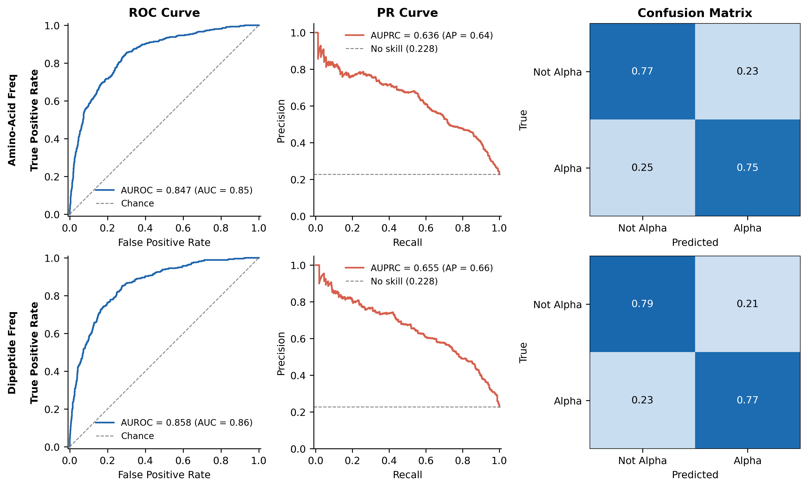

# Alpha-Helical Sequence Classifier

This project is a reproducible binary classifier for estimating whether a raw amino-acid sequence belongs to SCOP’s all-alpha structural class. It predicts **alpha** or **not-alpha** based on sequence-derived statistical features, with [SCOP](https://scop.mrc-lmb.cam.ac.uk/) serving as the structural ground-truth source.

> **Note:** This respository also used to demonstrate my exposure to Claude Code and how to orchestrate a project end to end with Claude.

---

## What is the objective?

Given an amino-acid sequence, the classifier returns a probability that the sequence belongs to SCOP's all-alpha class (`CL=1000000`). The objective is to establish transparent, reproducible baseline models that test how much alpha-class signal can be captured using simple representations of amino-acid composition.

The project currently explores two logistic-regression baselines. They share the same training procedure but differ in how they encode the input sequence:

| Baseline Model       | Dimensionality |
| -------------------- | -------------- |
| Amino-Acid Frequency | 20             |
| Dipeptide Frequency  | 400            |

Both models use L2 regularisation and balanced class weights to account for the approximately 23% prevalence of alpha sequences in the training data. These choices provide a controlled comparison between a compact composition-based representation and a richer representation that captures local adjacent-residue patterns.

---

## Table of Models Evaluated

| Model                | Val AUPRC | Val AUROC | Not-Alpha Recall | Alpha Recall |
| -------------------- | --------- | --------- | ---------------- | ------------ |
| Amino-Acid Frequency | 0.636     | 0.847     | 0.77             | 0.75         |
| Dipeptide Frequency  | 0.655     | 0.858     | 0.79             | 0.77         |

_This table is updated with each new model. Test-set results are withheld until final comparison._

---

## Data pipeline

The dataset combines SCOP structural annotations with the corresponding FASTA sequences. Before model training, sequences are validated, clustered, labelled, and split so that closely related sequences do not appear across training and evaluation partitions.

First, `validate_input` retains sequences composed of the canonical 20 amino acids and rewrites headers into a consistent form. Next, `cluster_sequences` uses MMseqs2 at 30% sequence identity to group related sequences. `build_dataset` joins cluster representatives with SCOP annotations to assign alpha or not-alpha labels, while `split_dataset` produces stratified, cluster-aware train, validation, and test sets. Finally, `train_baselines` evaluates the models with grouped cross-validation and records runs in MLflow.

```
SCOP annotation + FASTA
        │
        ▼
  validate_input          ← filter to canonical 20 AA, rewrite headers
        │
        ▼
  cluster_sequences       ← MMseqs2 at 30 % identity (--min-seq-id 0.3 --cov-mode 0)
        │
        ▼
  build_dataset           ← join representatives → annotations → labels
        │
        ▼
  split_dataset           ← 70 / 15 / 15 % stratified cluster-group split
        │
        ▼
  train_baselines         ← 5-fold StratifiedGroupKFold CV + val evaluation → MLflow
```

**Dataset snapshot (current build)**

| Partition | Sequences | Alpha          | Not-Alpha      |
| --------- | --------- | -------------- | -------------- |
| Train     | 9,279     | 2,115 (22.8 %) | 7,164 (77.2 %) |
| Val       | 1,987     | 454 (22.8 %)   | 1,533 (77.2 %) |
| Test      | 1,987     | 454 (22.8 %)   | 1,533 (77.2 %) |

The primary evaluation metric is AUPRC, which is more informative than AUROC due to the class imbalance in the dataset as alpha helical sequences account for roughly 23% of each split.

---

## Baseline Performance



_Confusion matrices are row-normalised (recall view). Each cell shows the fraction of true instances predicted in that column._

The amino-acid-frequency model is the simpler baseline, representing each sequence using only the fractional composition of each of the 20 canonical residues. The dipeptide-frequency model extends this representation by measuring frequencies of consecutive amino-acid pairs. This gives it 400 features and allows it to capture (some...) local sequence context that single-residue composition misses. In the current validation results, that added information improves AUPRC, AUROC, and recall for both classes. The trade-off is higher dimensionality and reduced interpretability relative to the 20-feature composition model.

---

## Setup

Create and activate the project environment with Conda:

```bash
conda env create -f environment.yml
conda activate protein-alpha-classifier
```

The clustering stage requires [MMseqs2](https://github.com/soedinglab/MMseqs2), which is installed through bioconda.

---

## Running the pipeline

Run the pipeline in the following order to download the SCOP inputs, construct the cluster-aware dataset, create splits, train the baselines, and regenerate the evaluation figure.

```bash
# 1. Download SCOP sources
python -m protein_alpha_classifier.pipelines.fetch_sources \
  --annotations-url https://www.ebi.ac.uk/pdbe/scop/files/scop-cla-latest.txt \
  --fasta-url https://www.ebi.ac.uk/pdbe/scop/files/scop_fa_represeq_lib_latest.fa \
  --out-dir data/raw/scop

# 2. Filter to canonical sequences
python -m protein_alpha_classifier.pipelines.validate_input \
  --fasta data/raw/scop/scop_fa_represeq_lib_latest.fa \
  --annotations data/raw/scop/scop-cla-latest.txt \
  --output-fasta data/interim/eligible_labeled_sequences.fasta \
  --invalid-records data/interim/omitted_ambiguous_sequences.parquet

# 3. Cluster at 30 % identity
python -m protein_alpha_classifier.pipelines.cluster_sequences \
  --input-fasta data/interim/eligible_labeled_sequences.fasta \
  --out-dir data/interim/mmseqs_30pct

# 4. Build ML-ready dataset
python -m protein_alpha_classifier.pipelines.build_dataset \
  --representatives data/interim/mmseqs_30pct/representatives.fasta \
  --annotations data/raw/scop/scop-cla-latest.txt \
  --cluster-assignments data/interim/mmseqs_30pct/cluster_assignments.parquet \
  --output data/processed/dataset.parquet

# 5. Split
python -m protein_alpha_classifier.pipelines.split_dataset \
  --dataset data/processed/dataset.parquet \
  --out-dir data/processed/splits \
  --test-frac 0.15 --val-frac 0.15 --seed 42

# 6. Train baselines and log to MLflow
python -m protein_alpha_classifier.pipelines.train_baselines \
  --train data/processed/splits/train.parquet \
  --val   data/processed/splits/val.parquet \
  --split-manifest data/processed/splits/split_manifest.json \
  --source-manifest data/raw/scop/source_manifest.json

# 7. Regenerate publication figure
python -m protein_alpha_classifier.pipelines.make_figures \
  --train data/processed/splits/train.parquet \
  --val   data/processed/splits/val.parquet \
  --out-dir figures/
```

Browse MLflow runs:

```bash
mlflow ui --backend-store-uri mlruns/
```

---

## Repository layout

```
src/protein_alpha_classifier/
  pipelines/       fetch_sources, validate_input, cluster_sequences,
                   build_dataset, split_dataset, train_baselines, make_figures
  features/        AACompositionTransformer, DipeptideCompositionTransformer
  models/          BASELINE_CONFIGS, pipeline factories
tests/             unit + integration tests (pytest)
docs/              governing documents (data contract, evaluation protocol, decisions)
figures/           baseline_comparison.png / .pdf
```

## Development

Run the following checks before contributing changes:

```bash
ruff check src tests      # lint
ruff format --check src tests
pytest -q                 # all tests
```
